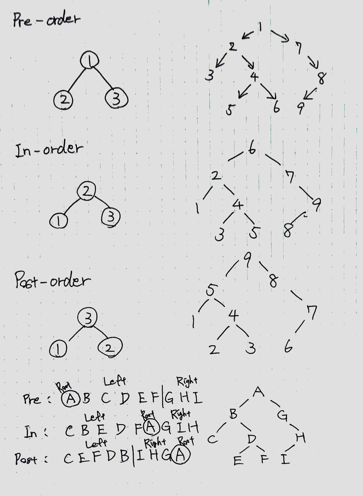

# 100 Days Of Code - Log

### Day 1: April 19, 2019

**Today's Progress**: I've solved a problem on LeetCode.

**Thoughts** I've written many of codes for nearly 10 years, but I don't have a systematic knowledge of algorithms. I'm going to learn it from now on! Today I've solved "Reverse String" in Rustlang. In the meanwhile, I found a `swap` method for vector. It's very functional because Rustlang doesn't permit take more than a mutable reference for an element of a vector.  In normal, an element should be cloned and be swapped with a temporary variable, but this way takes extra memory.

**Link(s) to work**
1. [Code](https://github.com/tamamu/100-days-of-code/commit/9cc8d4f6ab1c4372a1c5044b704b1f80f12e2eca)
2. [Reference of `swap` Method](https://doc.rust-lang.org/std/vec/struct.Vec.html#method.swap)

### Day 2: April 20, 2019

**Today's Progress**: I've solved a problem on LeetCode.

**Thoughts** There may exist a more memory-efficient way because my implementation has cloned each element. I think the most efficient way is unsafe. To implement recursive structures are my challenge.

**Link(s) to work**
1. [Code](https://github.com/tamamu/100-days-of-code/commit/3a4868867eecf60355230ca337979bbef3a68c0c)
2. [Reference of `Display` Trait](https://doc.rust-lang.org/std/fmt/trait.Display.html)

### Day 3: April 21, 2019

**Today's Progress**: I've solved a problem on LeetCode.

**Thoughts** First, memoization in Rust is more difficult than other languages! The global variable regulated to be sized in Rust, just like C. Second, using `Box` pointer is also difficult for recursive problem like Linked List. In this case, dividing into initial process and the remainder was key point to solve problem recursively.

**Link(s) to work**
1. [Pascal's Triangle1](https://github.com/tamamu/100-days-of-code/commit/40e249cc5b855841c6f0a2d6262a2ac012445131)
2. [Pascal's Triangle2 (memoized)](https://github.com/tamamu/100-days-of-code/commit/e75df4b6a89270087200846c273fde1efce54493)
3. [Pascal's Triangle3](https://github.com/tamamu/100-days-of-code/commit/d86e3a9b2ebf7f739d864f0f369374e894f1be82)
4. [Reverse Linked List](https://github.com/tamamu/100-days-of-code/commit/d818f60e17fb77e2caf10a4cd1882c448dac6c43)
5. [Rust 0ms Iterative](https://leetcode.com/explore/learn/card/recursion-i/251/scenario-i-recurrence-relation/2378/discuss/225512/Rust-0ms-Iterative)
6. [Reverse a list in Scala](http://www.thedigitalcatonline.com/blog/2015/04/07/99-scala-problems-05-reverse/#the-recursive-solution)
7. [Reference of `Option::take` Method](https://doc.rust-lang.org/std/option/enum.Option.html#method.take)
8. [Reference of Primitive `array` Type](https://doc.rust-lang.org/std/primitive.array.html)

### Day 4: April 22, 2019

**Today's Progress**: I've solved a problem on LeetCode.

**Thoughts** I know that `lazy_static` macro is commonly used for memoization, but it may not be able to use that on LeetCode. What else can I do memoization with unsized cache without `lazy_static`?

**Link(s) to work**
1. [Fibonacci Number](https://github.com/tamamu/100-days-of-code/commit/81cf70ff2aa5901227d7499e57c6222d1a5e5bb2)
2. [Climbing Stairs](https://github.com/tamamu/100-days-of-code/commit/19d9f3c0c45b13c44d6b1cbd841f86b705e26773)
3. [Reference of `thread_local!` Macro](https://doc.rust-lang.org/std/thread/struct.LocalKey.html)

### Day 5: April 23, 2019

**Today's Progress**: I've solved a problem on LeetCode, and done an experiment to confirm `n % 2 == 1` is equivalent to `n & 1 == 1`.

**Thoughts** It's a bit difficult to calculate time complexity and space complexity of recursive function. I don't know Rustlang supports tail recursion optimization, but it seems to be enable for release building.

**Link(s) to work**
1. [Maximum Depth of Binary Tree](https://github.com/tamamu/100-days-of-code/commit/2f32dbfd1f1ca1edd180d9ae60d987f05a9be670)
2. [Pow(x, n)](https://github.com/tamamu/100-days-of-code/commit/74f47c0acd964287679c961b6002db2dc010ddf9)
3. [Rust Trick Solution of Pow(x, n)](https://leetcode.com/explore/learn/card/recursion-i/256/complexity-analysis/2380/discuss/243952/Rust-Tricky-Solution)

### Day 6: April 24, 2019

**Today's Progress**: I've solved a problem on LeetCode.

**Thoughts** I've gotten used to write recursive function related to List and Tree! Option's `take` method is useful to manage ownership of elements in recursive structure.

**Link(s) to work**
1. [Code](https://github.com/tamamu/100-days-of-code/commit/24fc255fccc861ecc2f70a86cba0098467bc9874)

### Day 7: April 25, 2019

**Today's Progress**: I've solved a problem on LeetCode.

**Thoughts** Thinking `base case` and `recurrence relation` helps to solve the problem, K-th Symbol in Grammar. First I tried to generate each row recursively, but it took too many memory space, and caused Memory Limit Exceeded! Then I discovered each of rows is a concatenation of the previous row and the inverted.

**Link(s) to work**
1. [Code](https://github.com/tamamu/100-days-of-code/commit/eca2247dd18e1ce3db74c0fcad956255e4a748f1)

### Day 8: April 26, 2019

**Today's Progress**: I've solved a problem on LeetCode.

**Thoughts** It was very difficult for me to solve! I thought I should take an element as root, then I should concatenate another element as the parent or the child. Maybe I didn't miss the mark so much, but it was reckless to deal with a node recursively. In the end, I referenced an example written in JavaScript.

**Link(s) to work**
1. [Code](https://github.com/tamamu/100-days-of-code/commit/939bfb256a7517ae88d24e91d922634fba7701d2)
2. [JavaScript DFS with Memo](https://leetcode.com/explore/learn/card/recursion-i/253/conclusion/2384/discuss/151394/JavaScript-DFS-with-Memo)

### Day 9: April 27, 2019

**Today's Progress**: I've solved a problem on LeetCode.

**Thoughts** It was not so difficult, but I didn't have enough time to solve other problems because of my laziness...

**Link(s) to work**
1. [Code](https://github.com/tamamu/100-days-of-code/commit/9fcbc3ec9a2e51deff9e72f4696689ea9e84e127)

### Day 10: April 28, 2019

**Today's Progress**: I've solved a problem on LeetCode.

**Thoughts** It's my first time to use `drain` method for `Vec`! Actually, I didn't know how to use that. Today's problems are not so difficult for me. P.S. I was misunderstanding `drain` method, it's similar to `Option::take`, move the elements of the sequence to other variable.

**Link(s) to work**
1. [Inorder Traversal](https://github.com/tamamu/100-days-of-code/commit/48eddc8fee3fef0254daf6b3618029a02779d276)
1. [Postorder Traversal](https://github.com/tamamu/100-days-of-code/commit/33015ab11d2b26873c782c6b5dc2f6605febc17d)
1. [Level Order Traversal](https://github.com/tamamu/100-days-of-code/commit/ef0146db0f0b43eec38e48b37c002093c09e5fd8)

### Day 11: April 29, 2019

**Today's Progress**: I've solved a problem on LeetCode.

**Thoughts** I've gotten used to tree manipulation. By the way, I typed a tree of the test case every time, so it's bothersome! I think to create new snippets to reduce amount of typing.

**Link(s) to work**
1. [Symmetric Tree](https://github.com/tamamu/100-days-of-code/commit/4f37f2dd918e350b76b3b4565d18810dbbcf07cc)
1. [Path Sum](https://github.com/tamamu/100-days-of-code/commit/4f95672cf6b30dab14fa8d474e7694f3ef799446)

### Day 12: April 30, 2019

**Today's Progress**: I've solved a problem on LeetCode.

**Thoughts** I didn't come up with the solution by myself, so I referenced a Python solution as below. My code is very unlike Rust! I've used too many `clone` method...

**Link(s) to work**
1. [Code](https://github.com/tamamu/100-days-of-code/commit/7c2e18e9d764794ec7ccfbf038be936b75e6efb2)
1. [A Python recursive solution](https://leetcode.com/explore/learn/card/data-structure-tree/133/conclusion/942/discuss/34814/A-Python-recursive-solution)

### Day 13: May 1, 2019

**Today's Progress**: I've solved a problem on LeetCode.

**Thoughts** I referenced yesterday solution, and today's solution is almost as it is... I want to understand the problem more detail.

**Link(s) to work**
1. [Code](https://github.com/tamamu/100-days-of-code/commit/b809bfb021060b08c5ea03d39776e5634d9f4eb7)

### Day 14: May 2, 2019

**Today's Progress**: I've solved previous two problems on LeetCode again. 

**Thoughts** I've completely understood tree traversal and building! I drew a figure of traversal, and it helped for better understanding. Also I've been able to write the solution just like Rust, so I enjoyed to solve it very much!

**Link(s) to work**
1. [Inorder and Postorder](https://github.com/tamamu/100-days-of-code/commit/19a12664a93d2ab1b849eaf26866c87968b4753e)
1. [Preorder and Inorder](https://github.com/tamamu/100-days-of-code/commit/1914296c1f4927a2a62f2e08f26ac7e05988fb03)
1. 

### Day 15: May 3, 2019

**Today's Progress**: I've solved a problems on LeetCode. 

**Thoughts** The problem was not supported Rust, so I've written in C++. Today I don't have enough time to solve, and I solve it again tomorrow.

**Link(s) to work**
1. [Code](https://github.com/tamamu/100-days-of-code/commit/f6f06de61c253721ac415eaaa0eed34b7734a169)
